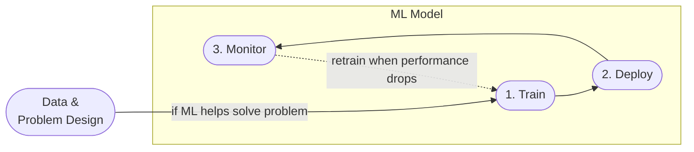

# mlops-learn

Documents Participation in MLOps Zoomcamp

---

For a clearer picture, we can look at a life-cycle of a machine learning model:

---

## Links

[Introduction](https://github.com/ovokpus/mlops-learn/tree/main/01-intro)

---

[Experiment Tracking](https://github.com/ovokpus/mlops-learn/tree/main/02-experiment-tracking)

---

